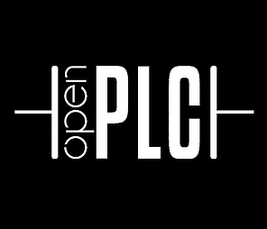

The OpenPLC Project consists of three parts: Runtime, Editor and HMI Builder.
The runtime should be installed on your device and is responsible for executing
your PLC program. The Editor is the software that runs on your computer and is
 used to create your PLC programs. Finally, ScadaBR is the HMI Builder. With
 ScadaBR you can create beautiful web-based animations that will reflect the
 state of your process. ScadaBR communicates with OpenPLC Runtime over
 Modbus/TCP.

To get started, click on each of the components to learn how to install them
on your system.

  

    
    
Runtime

  

  

    
    
Editor

  

  

    
    
HMI Builder

  

