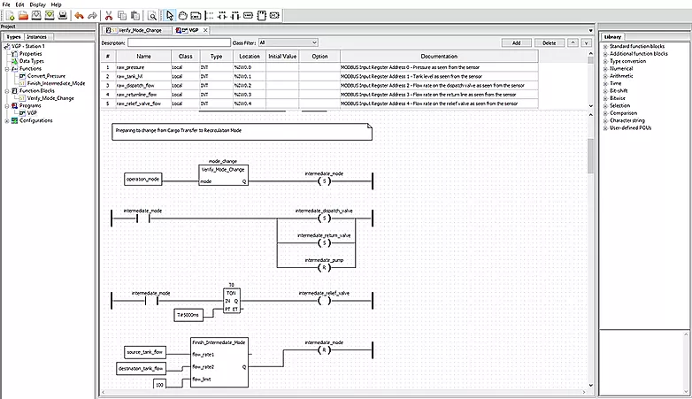

OpenPLC Editor is a software that lets you write PLC programs for the OpenPLC runtime. The programs are written according to the IEC 61131-3 standard. The editor is very simple to use and supports all five languages defined in the standard: Ladder Logic (LD), Function Block Diagram (FBD), Instruction List (IL), Structured Text (ST), and Sequential Function Chart (SFC).



<div class="image-links">
    <div class="row">
        <div class="six columns">
            <div class="download-link">
                <a href="https://drive.google.com/file/d/1SHNx2QYXn8HnZJ5eJ62uZKLzpGQn5cgs/view?usp=sharing">
                    
                    <span>OpenPLC Editor v1.0 for Windows</span>
                </a>
            </div>
        </div>
        <div class="six columns">
            <div class="download-link">
                <a href="https://github.com/thiagoralves/OpenPLC_Files/blob/master/Software/OpenPLC_Editor%20v1.0%20-%20Linux.zip?raw=true">
                
                <span>OpenPLC Editor v1.0 for Linux</span>
                </a>
            </div>
        </div>
    </div>
</div>

**Instructions for Windows**

Download, unzip, and double-click on the OpenPLC Editor shortcut.

**Instructions for Linux**

Download, unzip, and run on terminal:

```
./install.sh
```

Once the installation finishes, a shortcut for OpenPLC Editor will be created on the Applications menu.

**Commit hash**

The installer was created using source code from OpenPLC Editor repository in April 17, 2019.
