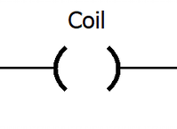

---
layout: inset
title: Ladder Logic Coil
redirect_from:
  - /reference-coil
--- 

The other fundamental element of a ladder diagram is the "coil". A
coil is similar to a relay coil, and therefore has only two states: energized or de-energized.

When there is a path of **true** instructions preceding the coil instruction, the
coil will be energized, and therefore will be also true. When a coil instruction is true, it
means that it is physically on. Coils are usually associated with PLC outputs, but they can also
be used as memory. A coil used as memory won't physically turn anything on or off, but will internally
save the state of the ladder rung it is connected to.

A variation of the coil instruction is the negated (or closed) coil. The negated
coil works similarly to the coil instruction, but with an inverted meaning. This means
that when there is a path of false instructions preceding the negated coil instruction, the
coil will be energized, and therefore will be also *true*.
