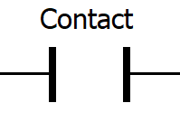

The fundamental element of a ladder diagram is the "contact". A contact is similar 
to a push button, and therefore has only two states: open or closed. An open contact breaks 
the current flow, whereas a closed contact allows the current to flow though it to the next element.

The contact instruction is sometimes also called examine if 
on (as in examine the input to see if it is physically on). This means that 
an input signal is needed to be present on the PLC input for the contact symbol to 
turn on. When the physical input is on, we can say that the contact instruction is true.

A variation of the contact instruction is the negated (or closed) contact. The negated 
contact is sometimes also called examine if off (as in examine the input to see if it is 
physically off). It works similarly to the contact instruction, but with an inverted 
meaning. This means that if an input signal is present on the PLC input, the negated contact will 
be false instead of true, while if there isn't any input signal on the PLC input, the negated contact will be true.