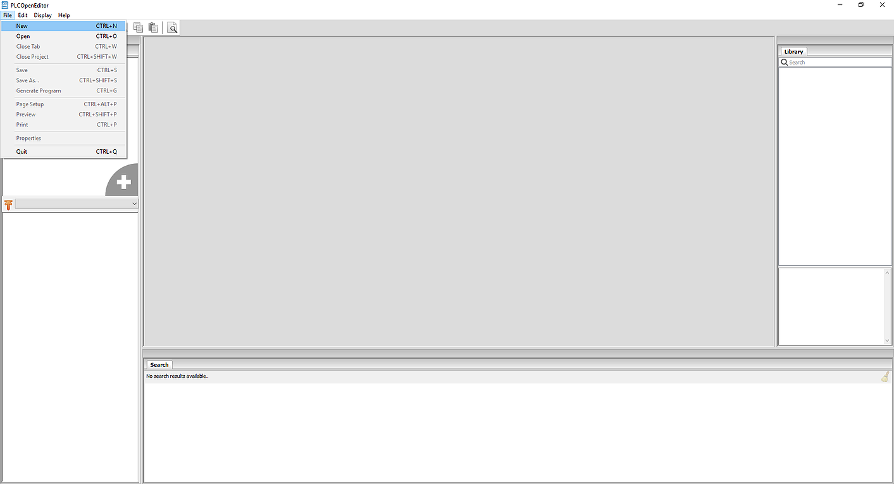

Now that you've learned the basics around Ladder Logic (LD), it's time to get your
hands dirty and code something for OpenPLC. This project is a simple on/off switch.
You will need:

- A [device](/runtime) with OpenPLC runtime installed
- Two push buttons
- One LED

Before you ask, if you're running OpenPLC in one of those industrial boards
(UniPi, PiXtend, etc) you might want to upgrade the LED to an Industrial 24V
Lamp instead. It will work the same. To start, wire your circuit just like
this:

**Important Observations:**

1. +V is the positive voltage level for your device. For example, for Arduino
  boards that's usually +5V, for Raspberry Pi it's +3.3V, and for industrial
  boards it's +24V.
1. PB1 and PB2 are push buttons (if the image is not clear enough)
  R1 and R2 are pull-down resistors. Anything from 1K to 10K should work. If
  you're using an industrial board, or a board with internal pull-down
  resistors, it is very likely that you won't need R1 nor R2 in your circuit.
  In that case you can connect PB1 and PB2 directly to %IX0.0 and %IX0.1.
1. On Raspberry Pi boards, the first two inputs (%IX0.0 and %IX0.1) are inverted
  in hardware. This can give you problems as it will be like if the buttons are
  constantly pressed. You can invert the input in your PLC program by using
  negated contacts (if you know how to do it) or you can just use other inputs
  instead, like %IX0.2 and %IX0.3.

​
To start creating your program, first you need to
[download OpenPLC Editor](/plcopen-editor) to your computer. After opening
OpenPLC Editor, you will need to create a new project. Click on File -> New to
start creating your project.

A save dialog will appear to let you choose where you want to store your
project. OpenPLC Editor projects are actually folders instead of a single
file. You cannot store a project in a folder that already has files in it.
Create a new folder for your project, open it and choose it as the location
for your project.

Once you have your location selected, OpenPLC Editor will create the project
for you with the default settings and configurations, and will open a new
dialog asking you to create a new POU. POU stands for Program Organization
Unit and is used to store all the code you write on your project. There are
three types of POUs you can create:

1. Program - application code combining inputs, outputs, functions and function
   blocks
1. Function - reusable user code that has a return value.
1. Function Block - reusable user code that can retain its state (instance)

For the purpose of this tutorial we are creating only one Program POU.
Therefore, just fill in the name for your program, make sure that the POU Type
is "program" and that the Language is "LD". Also, keep in mind that the name
of the program cannot contain spaces or special characters.

When you create a new program, OpenPLC Editor automatically creates a
configuration, a resource, a task, and an instance for you. Those items tell
OpenPLC what to do with your program (i.e. when to call a function, how to
operate cyclically, etc). You can edit these items by double-clicking on Res0
on the left panel.

The main window will display a global variable input field at the top (that
allows you to create global variables for your program), a Tasks window and
an Instances window. You can create new tasks by click on the green plus sign
inside the Tasks window. We are not creating new tasks for this project.
However, you may want to change the Interval for your task depending on what
hardware you are running OpenPLC on. PLC programs are cyclic, which means that
they start on the first instruction, finish on the last instruction, wait a
little bit and then do it all over again from the first to last instruction.
The task Interval means how often your program cycle will be called. The
default is 20ms, which means that your program will be executed once every
20ms. If you need your program to run more frequently, you can adjust the time
as you want. However, keep in mind that if you choose a very low cyclic time
(like 1ms), your program might consume 100% of your device's CPU and still your
device might not be able to run your program properly. A safe number for all
platforms is usually 50ms.

Now that your project if finally created, you can start to draw the ladder
logic diagram. Click on the name of your program on the left panel to open the
ladder logic editor. The top part of the screen is reserved for your variables.
The center part is used for your diagram. So, let's start by adding a few
variables. Click on the green plus sign, and add three variables:

Name | Class | Type | Location  |
-----|-------|------|-----------|
PB1  | Local | BOOL | %IX0.0    |
PB2  | Local | BOOL | %IX0.1    |
LAMP | Local | BOOL | %QX0.0    |

What we want to achieve with this program is that whenever PB1 is pressed,
the LAMP turns on, and remains on until PB2 is pressed. This is achieved by a
simple ladder logic latch circuit like this:

To create this circuit on the editor, start by adding a left power rail by
clicking on the power rail icon on the toolbar.

Adjust the left power rail pin count to 2 and stretch it a little bit so it
can fit both rungs comfortably. Then add a contact by clicking on the contact
button on the toolbar or by right clicking on the blank editor window and
selecting Add->Contact. On the window that appears, under the "Variable"
parameter, select PB1 to associate your new contact with the variable PB1.

Repeat the process to add two more contacts, one associated with PB2 and
another associated with LED. For the PB2 contact, select **Negated** as the
modifier. Finally, add a coil by clicking on the coil button on the toolbar or
by right clicking on the blank editor window and selecting Add->coil. Associate
your new coil with the LED variable, and add a right power rail to close the
circuit. Position the components in place so that they look like this picture:

The final step is to connect all the components by dragging their extremities
to form a line. Connect the left side of PB1 and LED contacts with the left
power rail. Connect the right side of PB1 with PB2, the right side of PB2 with
the LED coil, and the right side of the LED coil with the right power rail.
Draw the parallel LED contact circuit by connecting the right side of the LED
contact with PB2. Your final project should look like this:

This circuit initially has the LED powered off. When you press PB1 even for a
small instant, the circuit turns the LED on (given that PB2 is not pressed
also). Once the LED turns on, it bypasses the PB1 button on the circuit to turn
itself on continuously even after PB1 is not pressed anymore. This is a nice
trick in ladder logic, you can actually use outputs as contacts! Now, the only
way to turn the LED off is by pressing PB2. Since PB2 is a negated contact, it
will open the circuit once it is pressed, therefore turning off the LED.

Now that your project is created it is a good time to test it before uploading
it to the OpenPLC Runtime. You can simulate the behavior of your program by
clicking on **Start PLC Simulation** on the tool bar

When you click on that button your project is compiled using a similar process
to the OpenPLC Runtime. If there are any errors on your program, the
compilation will fail and you will be alerted about the errors on the Console
panel at the bottom of the screen. If the compilation succeeds, OpenPLC Editor
will then start running your code. To view your code running interactively,
click on Debug instance on the left panel:

This will open a new window where you can see the electrical flow of your
program. Lines in **green** are activated, where lines
in **black** aren't. You can force a contact or coil to be activated or
deactivated by right-clicking on it and selecting either **Force True**
or **Force False**. Try forcing PB1 to be true and observe the flow path to the
LAMP coil. Then force PB1 back to false and verify that LAMP is still
activated due to the latch circuit.

Apart from graphically viewing the electrical flow on the diagram, you can also
follow up the data in each variable of your program at the Debugger panel on
the right side of the screen. You can add variables to the Debugger panel by
clicking on the glasses icon in front of each variable from the panel on the
left. Also, by double-clicking a variable on the Debugger panel you can see a
graph in real-time showing the current values of the variable. This can be
really useful when your program is counting steps or manipulating data.

Finally, after you have created and tested you program, the last step is to
generate your program in a format that the OpenPLC Runtime will understand.
To do that, simply click on Generate program for OpenPLC Runtime on the tool
bar and save the .st file on your computer. This file is your ladder logic
program written in a language that OpenPLC Runtime can understand. You will
later [upload this .st file using OpenPLC's web interface](upload) to see it
running on a real device.
