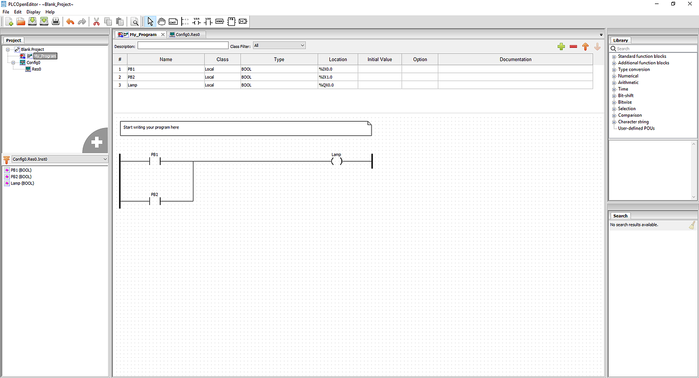

As explained in [What is a PLC](what-is-a-plc), OpenPLC can understand five different programming
languages. However, Ladder Logic (LD) is the most used and fundamental PLC language. Therefore, the basic
steps in this guide will help you to use LD with OpenPLC.

The structure behind LD is based on the electrical ladder diagrams that were used
with relay logic in the past. These diagrams documented how connections between devices were made on
relay panels. They are called "ladder" because they are constructed in a way that resembles a ladder with
two vertical rails and rungs between them. For example, take a look at this typical ladder diagram


This example shows a ladder diagram with two push buttons (PB1 and PB2) and a lamp. For the lamp to
turn on, it must be connected to both negative and positive power rails. On this diagram, the lamp
is only connected to the negative power rail, and therefore, it remains off. However, by
pressing PB1 or PB2, a path is formed from the positive power rail to the lamp, which turns it on. This
circuit that states the following:

```
IF PB1 OR PB2 is pressed THEN

Lamp turns on
```

Therefore, with the circuit above the lamp turns on only when PB1 or PB2 is pressed. Below is an example when PB2 is pressed:


You can build the same LD circuit for OpenPLC using the [OpenPLC Editor](/plcopen-editor). This
program will have the same behavior as the ladder diagram explained above.


