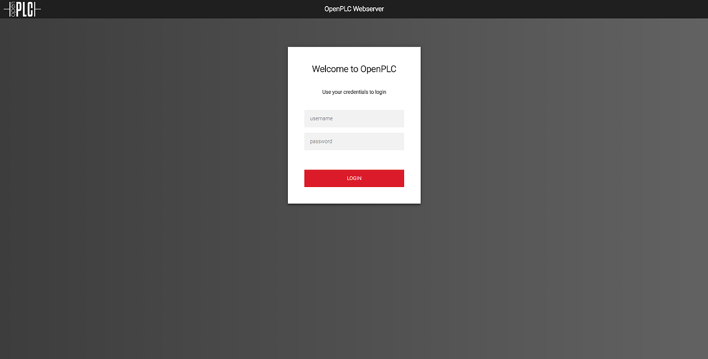
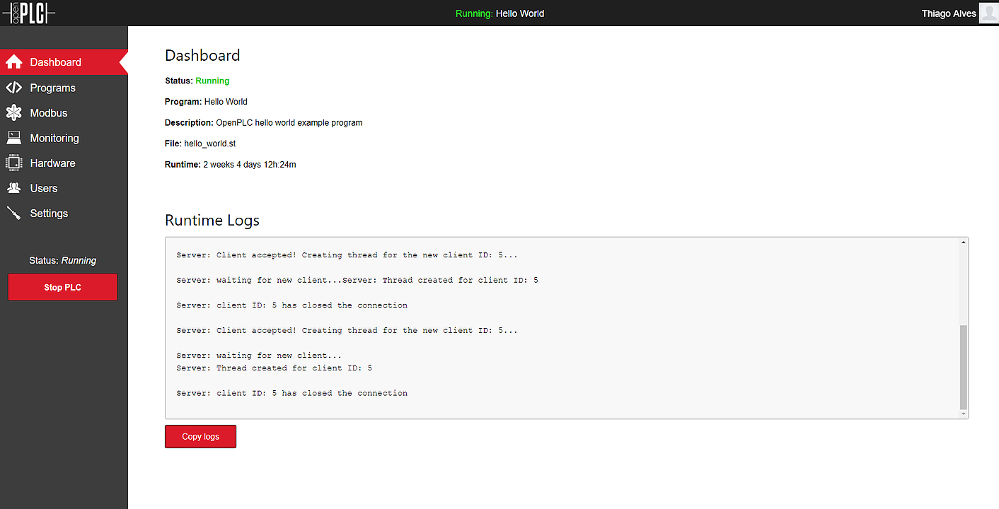
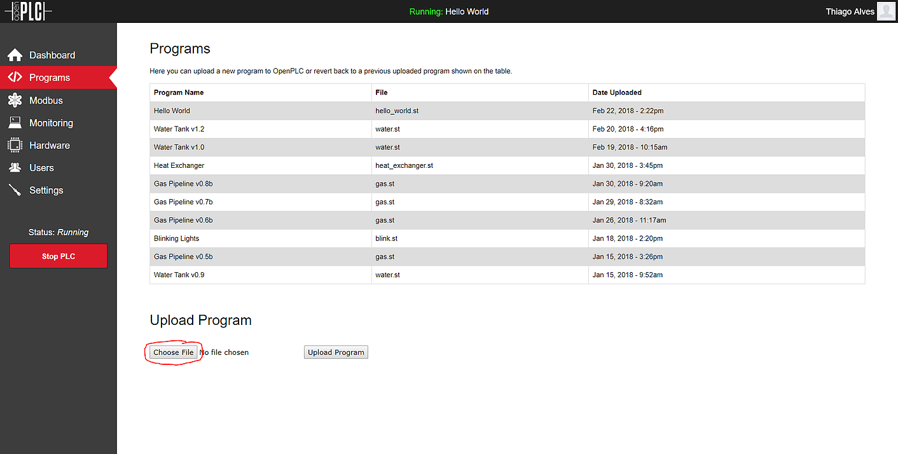
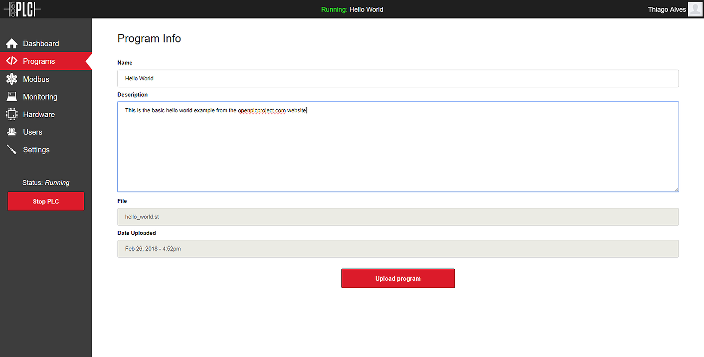
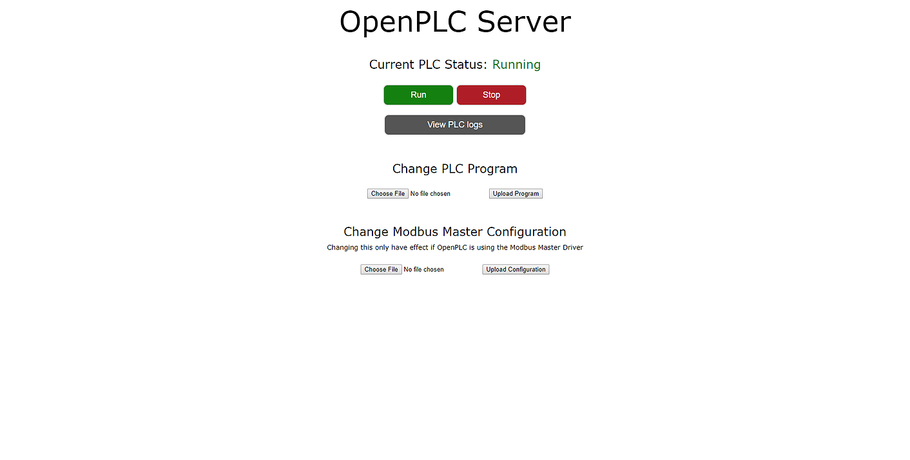

The OpenPLC runtime has a built-in webserver that allows you to configure OpenPLC and also to upload new programs for it to run. This webserver can be accessed by opening a web browser on your computer and typing the IP address of your OpenPLC device at port 8080. For example, if you're running OpenPLC on a Raspberry Pi device, and your Raspberry Pi has the IP 192.168.0.103 on your network, you should type this on your browser:

If you don't know the IP address of your OpenPLC device, the Raspberry Pi foundation has a [nice guide](https://www.raspberrypi.org/documentation/remote-access/ip-address.md) to help you out. If you installed OpenPLC runtime on your computer (e.g. OpenPLC runtime on Windows), then you can just open the browser and type localhost:8080 to access OpenPLC webserver.

Once you access OpenPLC webserver, you should see in your browser window a login page like this:

Login with the credentials you set up after installing OpenPLC v3. If you're still on OpenPLC v2 you won't see this login screen, as OpenPLC v2 webserver is much more simple. Keep reading, v2 instructions are at the end.

After logging in, you will see OpenPLC dashboard with some information about the current running program and the runtime logs.

To upload your new program, go to the Programs section on the left menu. In there you should see a list of all your programs uploaded recently. You can revert back to a previously uploaded program by just clicking on it in the list and then confirming on the next page. To upload a new program, click on "Choose File", select your .st file and then click on "Upload Program".

On the window that appears, just fill out some information about your program so that you know what it is about next time you try to load it again. Once you're done, click on "Upload program" to finally load your new .st file into OpenPLC.

Once the file is uploaded, you will be directed back to the dashboard screen and the OpenPLC status will change to "compiling". The logs about the compilation process are displayed on the runtime logs box. Once the compilation process is finished, the status will change to "running" and your new program will be run. If there was an error on your program, the status will change to "stopped" and the errors will be displayed on the runtime logs box.

If you're still on OpenPLC v2, the upload instructions are slightly different. OpenPLC v2 webserver is much simpler and don't have all the features OpenPLC v3 has. Once you access the OpenPLC v2 webserver in your browser, you should see this screen:

Then all you have to do is click on "Choose File" under the Change PLC Program section and then click on "Upload Program". Your program will be uploaded and compiled right after. The logs about the compilation process will be displayed on the screen. If the compilation succeeds, your new program will start running.
