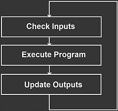

---
layout: reference
title: What is a PLC?
redirect_from:
  - /reference-what-is-a-plc
--- 

A PLC (Programmable Logic Controller) is a device that was invented to
replace the necessary sequential relay circuits for machine control back in the 70s. The
"programmable" term means that PLCs can receive instructions (programs) from the user to
perform the desired actions. Today, PLCs are everywhere, inside and outside industry. Almost any application
that needs some type of electrical control has a need for a PLC.

OpenPLC is the first and only PLC to be completely free and open source. That means that you
can start experimenting with PLCs today with basically no cost to you. All you need is a
computer and a cheap [hardware board](/runtime) (although you can still work without a hardware board, but that's no fun).

Any PLC mainly consists of a CPU, memory areas (called address space in OpenPLC) and
input/output circuits. Internally, a PLC works by continually scanning a program. This scan
cycle consists of 3 important steps: check inputs, execute program, and update outputs.

All a PLC will do in its whole life is execute those three steps. On the first step
it takes a look at each input and saves that information. After that, the PLC executes
your program, one instruction at a time. Based on your program and on the inputs
read in the previous step, the PLC will take decisions upon the state of the
outputs (if an output should turn on or off for example). The final step is to update the outputs according
to the calculated states from the previous step. This is when your output will finally turn on or off
based on your program and on the inputs.

Now that you know what a PLC is and how it works, you're probably ready to
dive-in to the most exciting part: programming your OpenPLC. The next steps on the
Reference material will guide you towards understanding Ladder Logic (LD), the fundamental
PLC language.

However, OpenPLC not only understands LD, but also four other languages that you
can use concurrently on your program:

- Instruction List (IL)
- Function Block Diagram (FBD)
- Sequential Function Chart (SFC)
- and Structured Text (ST).

After you learn LD, it will be easier to learn the other languages and explore their full potential.
