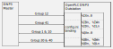

---
layout: inset-dev
title: DNP3 Outstation
--- 

OpenPLC can be configured as a DNP3 outstation (slave). An outstation is
typically controlled by a master, and performs local measurement and control.
The master may send control requests to the outstation and the outstation
reports the status of controls and measurements back to the master.



## Configuring DNP3 Outstation

To use OpenPLC as a DNP3 outstation, you must:

* define a binding between addresses in your PLC application and
  DNP3 points
* define DNP3 connection details

This information is defined in the `config.ini` configuration file in the
`dnp3s` section.

## Binding DNP3 Objects to PLC Addresses

OpenPLC supports a flexible binding between
[PLC addresses](/reference/plc-addressing) and DNP3 points.



Each `bind_location` key defines a one-way binding between a PLC address and
DNP3 point. The direction of the binding depends on the DNP3
group (described below).

The value of `bind_location` is an order-sensitive, comma-separated triple
defining the name of the PLC address, the DNP3 group and DNP3 index.

```
[dnp3s]
enabled = true
bind_location = name:%IX1.0,group:12,index:0
bind_location = name:%QW1.0,group:20,index:3
```

The above example defines binds two PLC addresses to two DNP3 points.

### Binary Output Command (Group 12)

Binary output commands are used to send control requests from the master to
the OpenPLC outstation.
OpenPLC supports the following variations for the Control Relay Output Block
group:

* Variation 1: Control relay output block

Binary output commands can be bound to `BOOL` PLC addresses. Except for the
most significant place (left-most), the hierarchical address place must be 0.
For example, the following is a valid binding:

```
bind_location = name:%IX1.0,group:12,index:0
````

Binding to `%IX1.2` is not valid because the second most-significant place
is non-zero (2);

The DNP3 binary output command supports several values. The DNP3 value
`LATCH_ON` is mapped to `TRUE`. Any other value is mapped to `FALSE`.

### Analog Output (Group 41)

Analog output commands are used to send analog (numeric) data from the master
to the OpenPLC outstation.
OpenPLC supports the following variations of the Analog Output group:

* Variation 1: 32-bit integer
* Variation 2: 16-bit integer
* Variation 3: single precision floating point
* Variation 4: double precision floating point

Analog outputs can be bound to the following PLC elementary data types:

| Bit-string | Signed Integer | Unsigned Integer | Floating point |
|---------|----------------|------------------|----------------|
| `BYTE`, `WORD`, `DWORD`, `LWORD` | `INT`, `SINT`, `DINT`, `LINT`, | `INT`, `SINT`, `DINT`, `LINT` | `REAL`, `LREAL` |



{% include important.html content="PLC addresses are updated via a
static cast from double to the
desired PLC type. The bound value is undefined if the DNP3 object value is
out of range for the bound PLC addresses. For example, 1e9 is
within the range of DNP3 object group 41 variation 1 (32-bit signed integer) but
it out of range of IEC type `SINT` (8-bit signed integer). The binding of
the values is undefined. It is your responsibility to ensure values written
via DNP3 are in range for the destination type." %}

### Binary Input (Group 1) and Binary Output Status (Group 10)

Binary input and binary output status are used to send Boolean information
from the OpenPLC outstation to the master. `BOOL` PLC addresses an be
bound to binary input and binary output status points.



### Analog Input (Group 30) and Analog Output Status (Group 40)

Analog input and analog output status are used to send floating point
information from the OpenPLC outstation to the master.

PLC addresses of the following elementary data types can be bound to counter
and frozen counter points:

| Bit-string | Signed Integer | Unsigned Integer | Floating point |
|---------|----------------|------------------|----------------|
| `BYTE`, `WORD`, `DWORD`, `LWORD` | `INT`, `SINT`, `DINT`, `LINT`, | `INT`, `SINT`, `DINT`, `LINT` | `REAL`, `LREAL` |



### Counter (Group 20) and Frozen Counter (Group 21)

Counter and frozen counter are used to send fixed-point information
information from the OpenPLC outstation to the master.

PLC addresses of the following elementary data types can be bound to counter
and frozen counter points:

| Bit-string | Signed Integer | Unsigned Integer | Floating point |
|---------|----------------|------------------|----------------|
| `BYTE`, `WORD`, `DWORD`, `LWORD` | `INT`, `SINT`, `DINT`, `LINT`, | `INT`, `SINT`, `DINT`, `LINT` | `REAL`, `LREAL` |
