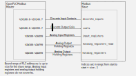

---
layout: inset-dev
title: Modbus Master
--- 

OpenPLC implements a Modbus master (client). A Modbus master is normally
used to control a remote device that acts as the slave (server). The Modbus
master reads and writes data to the slave, for example, to issue a command
to read the remote state.

You can create multiple instances of the Modbus master to communicate with
multiple Modbus slaves.

## Configuring Modbus Master

To use OpenPLC as a DNP3 outstation, you must:

* define PLC addresses in the supported range
* define the bound offset and number PLC addresses to bind
* define the connection details

This information is defined in the `config.ini` configuration file in the
`modbusmaster` section.

## Binding Modbus Master to PLC Addresses

OpenPLC binds ranges of [PLC addresses](/reference/plc-addressing) to Modbus
addresses. You define an offset (start address) and number of PLC addresses
to bind.

Up to 400 PLC addresses per Modbus table can be bound to the Modbus master.
Mapping to a particular Modbus table (for example discrete output coils)
is determined based on the data width, direction, and an offset.

| Modbus table                    | PLC Address           | Data Size | Access† |
|---------------------------------|-----------------------|-----------|---------|
| Discrete Output Coils           | `%IX100.0 - %IX149.7` | 8-bit     | W       |
| Discrete Input Contacts         | `%QX100.0 - %QX149.7` | 8 bit     | R       |
| Analog Input Registers          | `%IW100 - %IW500`     | 16-bit    | R       |
| Analog Output Holding Registers | `%QW100 - %QW500`     | 16-bit    | RW      |



OpenPLC treats bit-bit PLC addresses as opaque 2-byte blocks. It does not
interpret elementary data type nor the stored value. You can therefore use
any of the 16-bit PLC addresses (`WORD`, `INT`, `UINT`) to Modbus analog
registers. Analog output holding registers are read prior to read.

The offset (and size) defines how PLC hierarchical addresses binds to Modbus
data addresses. For example, if `input_registers_start = 50` and
`input_registers_size = 10`, then `%IW100 - %IW110` bind to Modbus data addresses
0x32 to 0x3B (register numbers 30051 to 30050).
