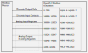

---
layout: inset
title: Modbus Slave
redirect_from:
  - /scada
--- 

OpenPLC can be configured as a Modbus slave (server). A Modbus slave is
normally controlled by a master, and performs local measurement and control.
The remote master initiates read and write requests to the OpenPLC slave.

OpenPLC supports all common Modbus function codes:

* Read discrete output coil (0x01)
* Write discrete output coil (0x05)
* Write multiple discrete output coils (0x0F)
* Read discrete input contacts (0x02)
* Read analog input registers (0x04)
* Read analog output holding registers (0x03)
* Write analog output holding register (0x06)
* Write multiple analog output registers (0x10)

## Binding Modbus Slave to PLC Addresses

OpenPLC operates as a block for Modbus tables. [PLC address](/reference/plc-addressing) binding (the
Modbus map) is based on the hierarchical address value, the data width,
and the direction.



<div class="table-wrapper" markdown="block">

| Modbus Table                     | Usage           | PLC Address        | Modbus Data Address | Data Size | Range  | Access† |
|----------------------------------|-----------------|--------------------|---------------------|-----------|--------|---------|
| Discrete Output Coils            | Digital Outputs | `%QX0.0 - %QX99.7` | 0 - 799             | 1 bit     | 0 or 1 | RW      |
| Discrete Input Contacts          | Digital Inputs  | `%IX0.0 - %IX99.7` | 0 - 799             | 1 bit     | 0 or 1 | R       |
| Analog Input Registers           | Analog Input    | `%IW0 - %IW1023`     | 0 - 1023            | 16 bits   | 0 - 65535 | R    |
| Analog Output Holding Registers  | Analog Outputs  | `%QW0 - %QW1023`     | 0 - 1023            | 16 bits   | 0 - 65535 | RW   |

</div>

Discrete output coil and discrete input contact binding are based on the
the two-part PLC address, without unused Modbus data addresses. The
least-significant part of the PLC address has a range 0 to 7, therefore, a
little math is needed to translate between PLC addresses and Modbus data
addresses.

Given the Modbus data address, the PLC address is determined as:

```
msp := int(modbus_data_address / 8)
lsp := modbus_data_address mod 8
hierarchical_address = str(msp) + "." " str(lsp)
```

For example, if the Modbus address for a discrete output coil is 22, then the
most significant part is 2 (22 / 8) and the least significant part is 6
(22 mod 8). Therefore, the PLC address is `%Q2.6`.

Memory PLC addresses are mapped to higher-index analog output registers.

<div class="table-wrapper" markdown="block">

| Modbus Table                     | Usage           | PLC Address      | Modbus Data Address | Data Size | Range     | Access† |
|----------------------------------|-----------------|------------------|---------------------|-----------|-----------|---------|
| Analog Output Holding Registers | General 16-bit Register | %MW0 - %MW1023 | 1024 - 2047    | 16 bits   | 0 - 65536 | RW      |
| Analog Output Holding Registers | General 32-bit Register | %MD0 - %MD1023 | 2048 - 4095    | 32 bits   | 0 - 4294967295 | RW |
| Analog Output Holding Registers | General 64-bit Register | %ML0 - %ML1023 | 4096 - 8191    | 64 bits   | 0 - really big | RW |

</div>


