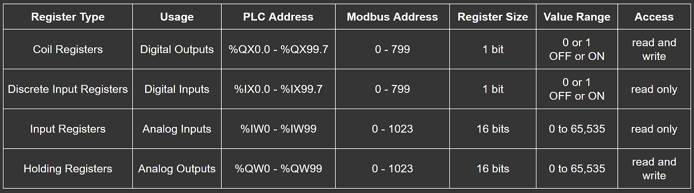
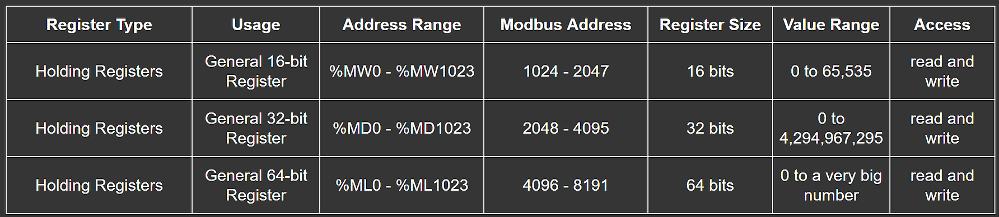

---
layout: inset
title: Modbus Address Mapping
redirect_from:
  - /scada
--- 

OpenPLC uses the Modbus/TCP protocol for SCADA communication. Modbus is one of
the most used protocols in industry, is open source and royalty-free. This
makes OpenPLC compatible with virtually any SCADA software in existence.

Modbus has mainly 4 functions, each one responsible for reading or writing to
a specific I/O. The I/O address space on the OpenPLC is mapped to the Modbus
address space according to the table below:

OpenPLC also provides a separated address space for memory variables with
support for 16, 32 and 64 bit variables. The memory address space is detailed
on the table below:

