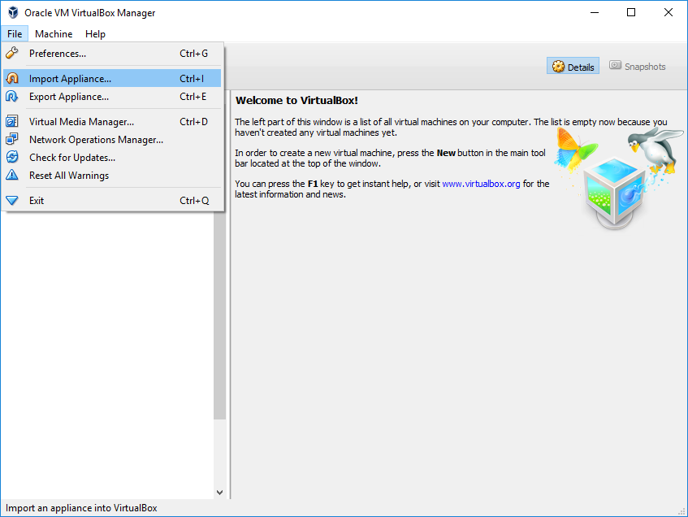
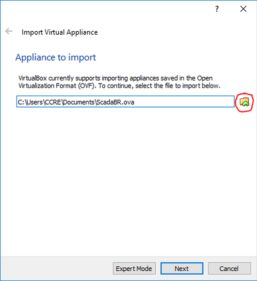
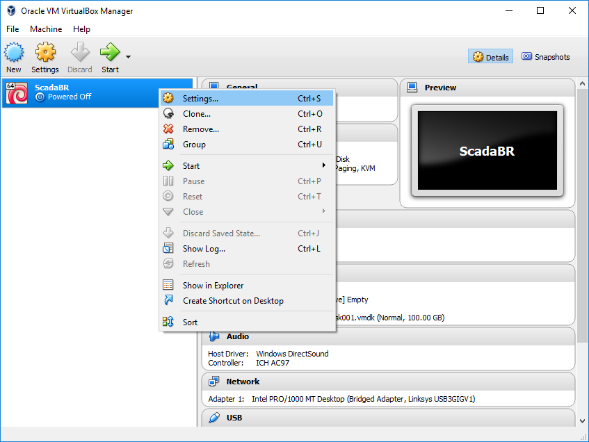
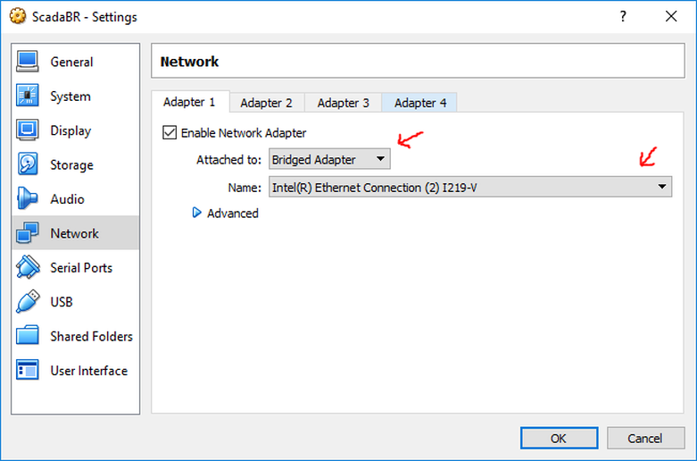
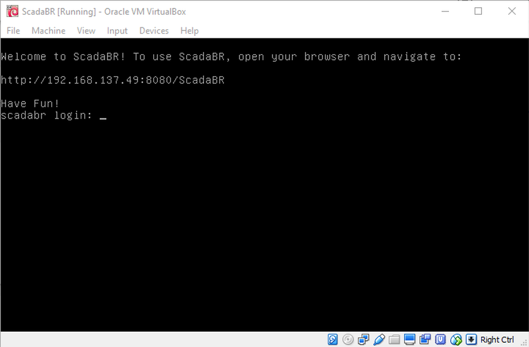
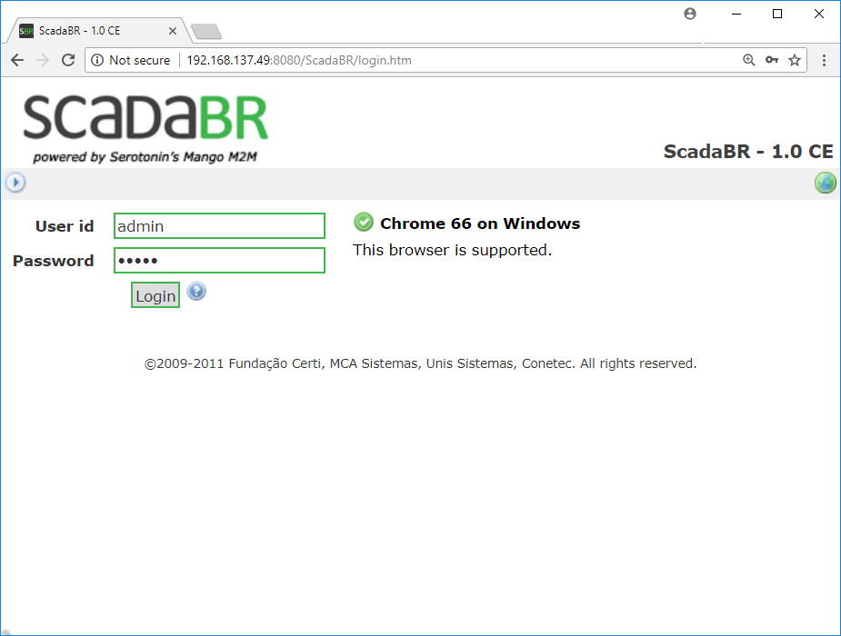

## Installing ScadaBR using a Virtual Machine

ScadaBR is an open source Supervisory Control and Data Acquisition (SCADA)
system that allows you to create interactive screens, also called Human
Machine Interface (HMI), for your automation projects. ScadaBR can talk to
several different PLCs, including OpenPLC, which makes it a perfect companion
for the OpenPLC runtime and editor.

The simplest way to install ScadaBR is by using a Virtual Machine. A Virtual
Machine is a software that can create a virtual computer inside your own
computer. The following steps will guide you to download and install
VirtualBox, a free and open source Virtual Machine Monitor. Once VirtualBox
is installed, all you have to do is load the ScadaBR image file into
VirtualBox to have a ready-to-use ScadaBR environment on your system.

ScadaBR Installation Steps:

1. Download VirtualBox from the
   [official website](https://www.virtualbox.org/wiki/Downloads)
2. Download ScadaBR virtual image file
   [from here](https://drive.google.com/file/d/1gEOZmN9_Nt5shXy4iYS1z_EMxB4r0Kzh/view?usp=sharing)
3. Install VirtualBox by running the installer downloaded on step 1.
4. Run VirtualBox and import ScadaBR image by clicking on File -> Import Appliance
   
5. Click on the folder icon and select the ScadaBR.ova file downloaded on step 2.
   
6. Click on Next and then Import to load ScadaBR image into VirtualBox.
7. Before starting ScadaBR, you need to configure the network of your virtual
   machine so that ScadaBR can see the PLCs connected to your network. On
   VirtualBox main window, right-click on ScadaBR and select settings
   
8. Go to Network and at the option "Attached to:" make sure that Bridged
   Adapter is selected. Then on "Name:" choose your network adapter.
   VirtualBox will replicate your network adapter for the virtual machine.
   Therefore, make sure that the adapter you select is actually the network
   adapter that is connected to your network. Once you're done, click on OK
   to close this window.
   
9. Now you're good to go! On the main VirtualBox screen click on Start to
   launch ScadaBR. It might take a few seconds to load. Once it is finally
   loaded, you will see this message on the screen:
   

## Installing ScadaBR on Linux Natively

If you don't want to use a Virtual Machine to install ScadaBR, you can also
install it natively on Linux (not compatible with ARM devices). All you have
to do is clone the repository with ScadaBR installer and run the installer
script:

```
git clone https://github.com/thiagoralves/ScadaBR_Installer.git

cd ScadaBR_Installer

./install_scadabr.sh
```
​
Wait until the script install all the required components (JRE6 and Tomcat6)
which can take about 5 minutes or less. Launch your browser and confirm that
ScadaBR was installed by going to **http://localhost:9090/ScadaBR**. If the
page loads then your installation was successful. If you get errors, wait a
few minutes and try again. ScadaBR can take a few minutes to load entirely
the first time it is launched.

This script installs ScadaBR 0.9. If you want to update to ScadaBR 1.0CE,
run *./update_scadabr.sh* from terminal. Make sure to open ScadaBR at least
once before running this script, otherwise you might end up with a corrupted
installation.

## Using ScadaBR

ScadaBR is a web application. To use it, you will need to open the browser on
your computer and navigate to the address shown on the message (if you
installed using the Virtual Machine approach) or to the address
**http://localhost:9090/ScadaBR** (if you installed natively on Linux). You
will then be presented with a login page. Use the following credentials to
login for the first time:

User id: admin
Password: admin



ScadaBR offers many features that you may find useful. They are all listed on
the top menu, right below the ScadaBR logo. However, if you want to just stick
to the basics, all you will have to do is configure your PLCs on Data Sources
(6th icon from the left). If you're adding an OpenPLC device, make sure to
select the Modbus IP protocol. After you've added all your devices on the Data
Sources menu, you can also add your Points, which are the specific data
elements that you want to read from your PLC.

Finally, to create your graphical screens, go to Graphical Views (2nd icon from
the left). With your points configured, all you have to do is drag and drop
animations to the screen and associate each animation component with a
previously added point.

If you want to know more deeply about all ScadaBR features, consider reading
[ScadaBR Manual here](https://sourceforge.net/p/scadabr/wiki/Manual%20ScadaBR%20English%200%20Summary/).
