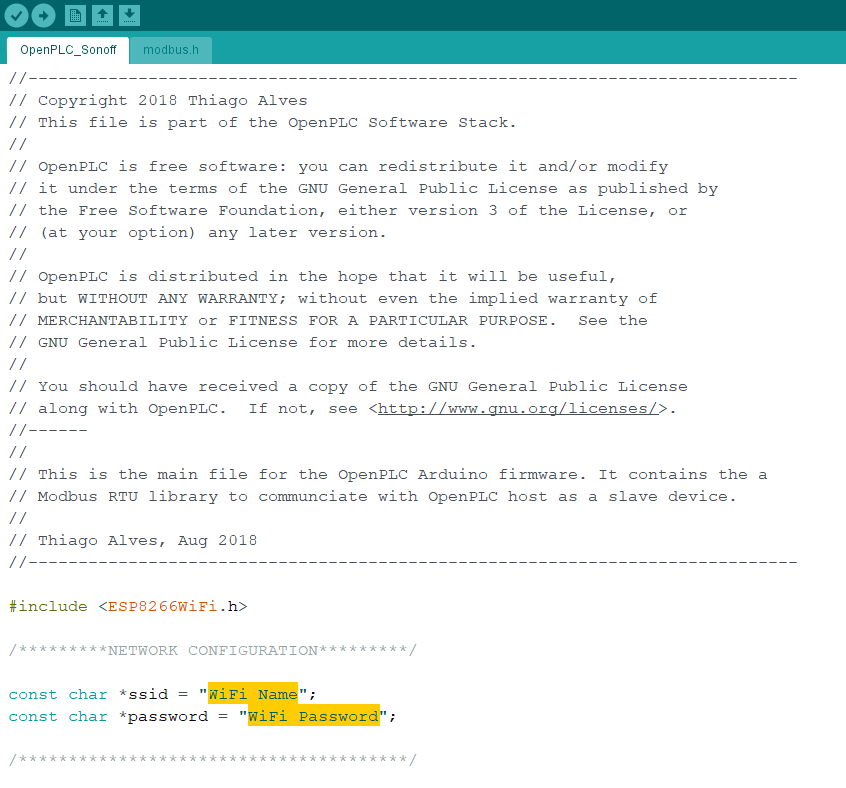
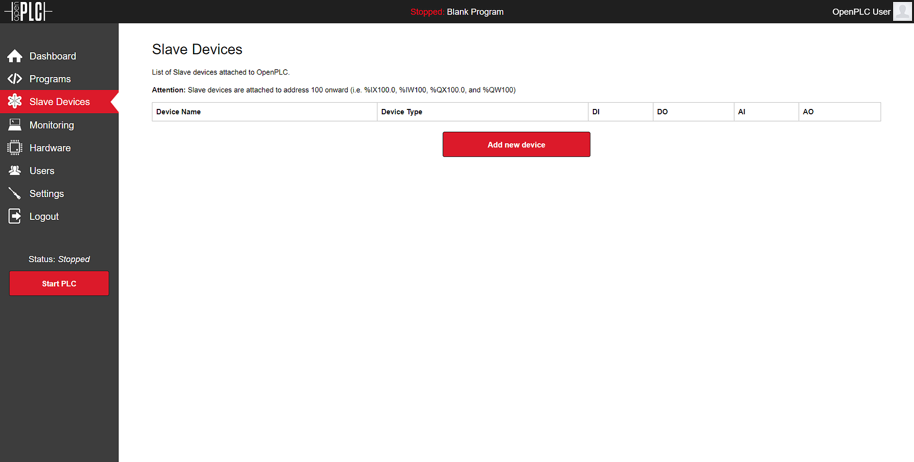
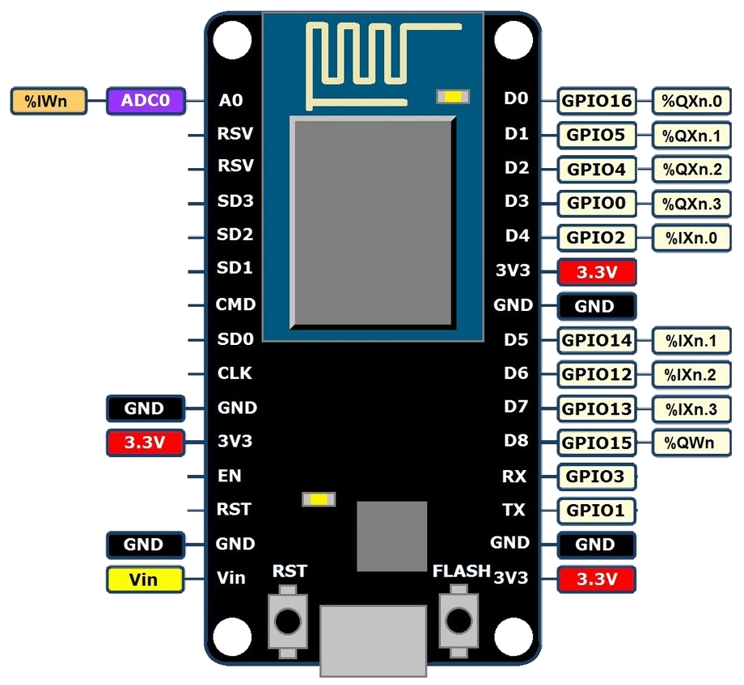

You can attach ESP8266 boards as wireless slave devices to expand the number
of your I/O points. This is particularly useful for systems that don't have
any I/O points at all (in case of OpenPLC running on Windows for example).

## Set Up Your Host

Given that ESP8266 boards can only work as slave devices, the first thing you
need to do is set up your host. In other words, you need to have OpenPLC
Runtime installed on your system to proceed. You can use any of the listed
devices on the Getting Started page as a host. The most common options are
[Windows](/runtime/windows), [Linux](/runtime/linux) and
[Raspberry Pi](/runtime/raspberry-pi). Just follow the instructions on the
page to have it installed and then move to the next step.

## Upload Firmware

The ESP8266 firmware was written using the Arduino IDE. This is probably the
easiest platform to program the ESP8266. The first thing you need to do is
setup your Arduino IDE to program ESP8266 devices (if you haven't done it
already). Open up Arduino IDE, then go to the Preferences (File > Preferences)
and then, towards the bottom of the window, copy this URL into the
“Additional Board Manager URLs” text box:

```
http://arduino.esp8266.com/stable/package_esp8266com_index.json
```
​
Then navigate to the Board Manager by going to Tools > Boards > Boards Manager.
There should be a couple new entries in addition to the standard Arduino
boards. Look for ESP8266. Click on that entry, then select Install.

The board definitions and tools for the ESP8266 include a whole new set of gcc,
g++, and other reasonably large, compiled binaries, so it may take a few
minutes to download and install (the archived file is ~110MB). Once the
installation has completed, an Arduino-blue “INSTALLED” will appear next to
the entry.

Finally, download the OpenPLC firmware for the ESP8266, unzip it and open it
on the Arduino IDE.

<div class="download-link">
    <a href="https://github.com/thiagoralves/OpenPLC_Files/blob/master/Firmware/OpenPLC_esp8266_v3.zip?raw=true">
      
      <span>ESP8266 Firmware</span>
    </a>
</div>

Before uploading the firmware to the ESP8266 board, you will need to insert
your network parameters (WiFi name and password) in the code. The information
you need to modify is on the first lines of the code:



Substitute "WiFi Name" with your WiFi Network name (SSID) and "WiFi Password"
with your WiFi password. Then upload the code to your ESP8266 board. Just
make sure the correct board is selected in Tools > Board and that the correct
port is selected in Tools > Port.

Now that the board is running the OpenPLC firmware you need to know what IP
address it got on your network. For that, just open the Arduino IDE Serial
Monitor and look for the messages that appear.

​

With the Serial Terminal open, you should see messages like this:

```
Connecting to My Wifi.........
WiFi connected
Server started
My IP: 192.168.1.4
```

Write down the IP address on that message because you will need to use it on the next step.

## Add A Slave Device to OpenPLC

After programming your ESP8266 with OpenPLC's firmware, you now need to add
it to the main Runtime. Launch OpenPLC Runtime on your host, log in on the
web interface, go to Slave Devices on the menu and click on "Add new device".

​

On the new screen that appears, fill out the name for your slave device (it can be anything, but just please avoid non-english characters like ç, é, ó, ñ), select ESP8266 under Device Type and type in the ESP8266 IP address that you got from the previous step. Everything else should be filled up automatically for you.

​

Click on "Save device" and you're good to go! Just start the PLC and your board will be communicating over WiFi with OpenPLC Runtime.

## Pin Mapping

The pin mapping for your ESP8266 depends on its position on the slave devices list. OpenPLC supports multiple slave devices at the same time, and they all add up together on the address space. Below you can see a list of three ESP8266 devices added up together, and the respective address space reserved for them.

​

On the device itself, each located variable maps to a corresponding pin. The picture below shows a generic pin mapping on a NodeMCU board (which is the most popular ESP8266 board). Please change "n" with the appropriate starting address for your device on the list (it starts with 100).

​
