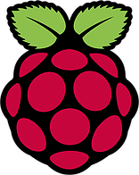

The OpenPLC Runtime must be installed on your device for it to be able to
execute PLC programs. The OpenPLC Runtime supports several embedded system
platforms, and can also be installed on Windows and Linux machines as a
soft-PLC. You can even use slave devices (such as Arduino boards) to expand
your I/O points or use them as your main soft-PLC I/O.

## Embedded Platforms

  

    <a href="http://www.freewave.com/products/zumlink-900-series/">
      
      
FreeWave Zumlink Radio ⭧

    </a>
  

  

    <a href="raspberry-pi">
      
      
Raspberry Pi

    </a>
  

  

    <a href="pixtend">
      
      
PiXtend

    </a>
  

  

    <a href="unipi">
      
      
UniPi Industrial Platform

    </a>
  

  

    <a href="https://www.freewave.com/products/zumiq-edge-computer/">
      
      
FreeWave ZumIQ⭧

    </a>
  

  

    <a href="unipi-neuron">
      
      
UniPi Neuron PLC

    </a>
  

## Soft-PLCs

  

    <a href="windows">
      
      
Windows

    </a>
  

  

    <a href="linux">
      
      
Linux

    </a>
  

## Slave Devices

  

    <a href="modbus-slaves">
      
      
Modbus Slave Devices

    </a>
  

  

    <a href="esp8266">
      
      
ESP8266

    </a>
  

  

    <a href="arduino">
      
      
Arduino and compatible boards

    </a>
  

  

    <a href="sonoff-basic">
      
      
Sonoff Basic

    </a>
  

