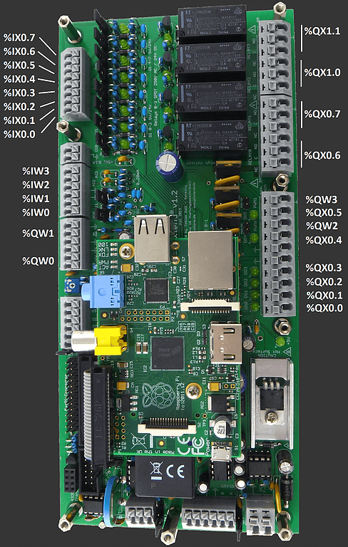

Make sure that your PiXtend is running a recent version of the Raspbian
operating system. To avoid compatibility problems, it is better to download
the most recent Raspbian form the
[Raspberry Pi website](https://www.raspberrypi.org/downloads/) and make a fresh
install.​

The best way to get OpenPLC files into your PiXtend is by using git. Usually,
git comes pre-installed on Raspbian. If for some reason you don't have git
installed on your system, you can install it by typing:
​
```
sudo apt-get install git
```




## Pin Mapping

By default OpenPLC runtime is installed with a blank driver. This means that
it won't be able to control your PiXtend inputs and outputs straight away. To
enable the PiXtend driver, go to the "Hardware" section and from the popup
menu, select either "PiXtend" or "PiXtend 2s" depending on your board. Click
on "Save changes" and wait for a little bit while the driver is applied.


Below you will find the OpenPLC I/O mapping for the PiXtend board. The mapping
should be the same across all the different board revisions.




