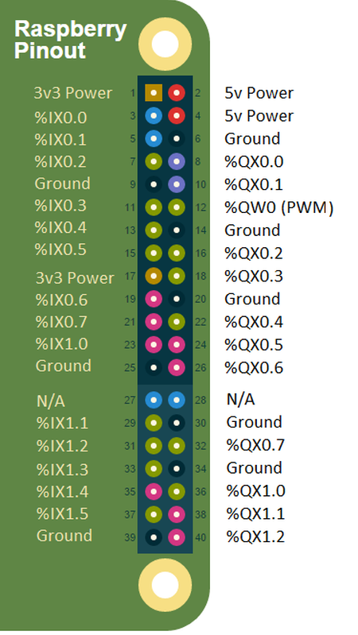

Make sure that your Raspberry Pi is running a recent version of the Raspbian
operating system. To avoid compatibility problems, it is better to download
the most recent Raspbian form the
[Raspberry Pi website](https://www.raspberrypi.org/downloads/) and make a fresh
install.

The best way to get OpenPLC files into your Raspberry Pi is by using git.
Usually, git comes pre-installed on Raspbian. If for some reason you don't have
git installed on your system, you can install it by typing:

```
sudo apt-get install git
```




## Pin Mapping

By default OpenPLC runtime is installed with a blank driver. This means that it won't be able to control your Raspberry Pi pins straight away. To enable the Raspberry Pi driver, go to the "Hardware" section and from the popup menu, select either "Raspberry Pi" or "Raspberry Pi - Old model (2011 model B)" depending on your board. Click on "Save changes" and wait for a little bit while the driver is applied.


Below you will find the OpenPLC I/O mapping for the Raspberry Pi header. The mapping should be the same across all the different board revisions.



There is only one analog (PWM-based) output on the Raspberry Pi, and it is used as the an Analog Out (%QW0.0) on the OpenPLC. Also, take note that the first two inputs (%IX0.0 and %IX0.1) have hardware pullups, which means that if you don't connect anything to them, they will both read as TRUE. This is part of the design of the Raspberry Pi boards, and can't be changed by the OpenPLC software. Therefore, the logic on these first two inputs must be reverse.


