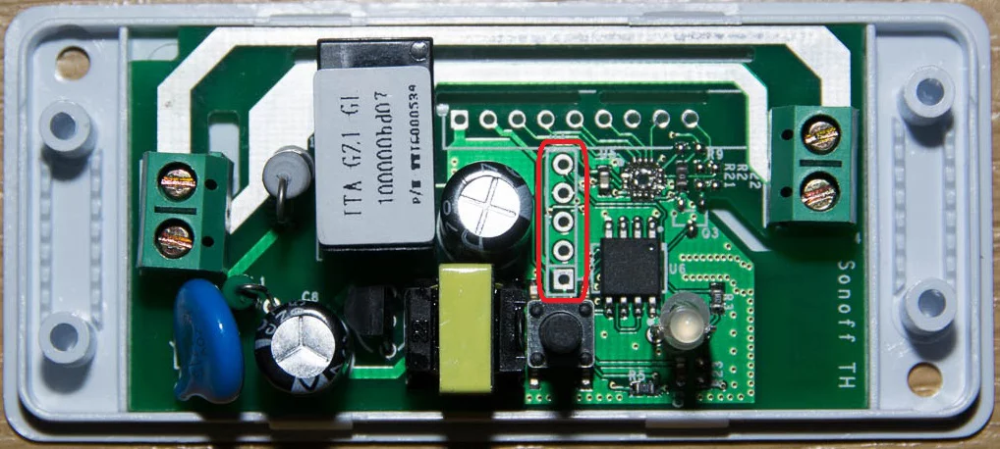
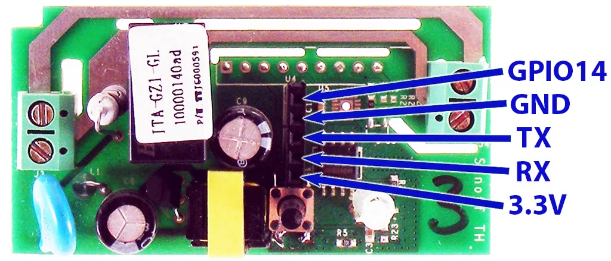
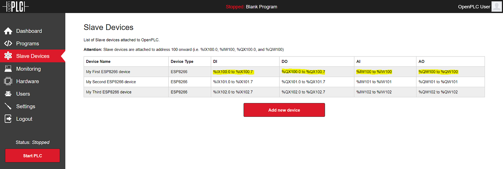

You can attach Sonoff Basic as wireless slave devices to expand the number of
your I/O points. This is particularly useful for systems that don't have any
I/O points at all (in case of OpenPLC running on Windows for example).

## Set Up Your Host

Given that Sonoff Basic can only work as slave devices, the first thing you
need to do is set up your host. In other words, you need to have OpenPLC
Runtime installed on your system to proceed. You can use any of the listed
devices on the Getting Started page as a host. The most common options are
[Windows](/runtime/windows), [Linux](/runtime/linux) and
[Raspberry Pi](/runtime/raspberry-pi). Just follow the instructions on the
page to have it installed and then move to the next step.

## Upload Firmware

The original Sonoff Basic firmware runs a proprietary code OpenPLC cannot
understand. Therefore, to make your Sonoff device communicate with OpenPLC,
you first need to change its firmware. The OpenPLC firmware was written using
the Arduino IDE, which is probably the easiest platform to reprogram the
Sonoff Basic.

<span style="color:red">Beware: By following these steps you will be replacing the original Sonoff Firmware and voiding the device's warranty. There is no way to change back to the original firmware after you have replaced it with OpenPLC firmware, unless you have the files for the original firmware. Only proceed if you understand this and know the risks involved.</span>

I put the red beware disclaimer up there just so that everyone know that you will be messing up with the internals of your Sonoff device. However, given that this little thing costs only about $6.00, if you manage to break the whole thing, it is not a big deal, right!? So let's proceed...

The Sonoff Basic is internally an ESP8266, so the procedure to reprogram it will be very similar to any other ESP8266-based board. The first thing you need to do is setup your Arduino IDE to program ESP8266 devices (if you haven't done it already). Open up Arduino IDE, then go to the Preferences (File > Preferences) and then, towards the bottom of the window, copy this URL into the “Additional Board Manager URLs” text box:

```
http://arduino.esp8266.com/stable/package_esp8266com_index.json
```

Then navigate to the Board Manager by going to Tools > Boards > Boards Manager. There should be a couple new entries in addition to the standard Arduino boards. Look for ESP8266. Click on that entry, then select Install.

The board definitions and tools for the ESP8266 include a whole new set of gcc, g++, and other reasonably large, compiled binaries, so it may take a few minutes to download and install (the archived file is ~110MB). Once the installation has completed, an Arduino-blue “INSTALLED” will appear next to the entry.

Now you need to configure your Arduino IDE specifically for the Sonoff Basic device. Go to Tools -> Board and select "Generic ESP8266 Module". Then configure the other parameters as follows:


```
Flash Mode: "DOUT"

Flash Size: "512K (no SPIFFS)"

Debug port: "Disabled"

Debug Level: "None"

Reset Method: "ck"

Flash Frequency: "40MHz"

CPU Frequency: "80MHz"

Upload Speed: "115200"
```
​

And don't forget to select the right COM Port based on your USB to Serial adapter.

Finally, download the OpenPLC firmware for the Sonoff Basic, unzip it and open it on the Arduino IDE

<div class="download-link">
    <a href="https://github.com/thiagoralves/OpenPLC_Files/blob/master/Firmware/OpenPLC_sonoff_v3.zip?raw=true">
      
      <span>Sonoff Basic Firmware</span>
    </a>
</div>

Before uploading the firmware to the ESP8266 board, you will need to insert your network parameters (WiFi name and password) in the code. The information you need to modify is on the first lines of the code:


Substitute "WiFi Name" with your WiFi Network name (SSID) and "WiFi Password" with your WiFi password.

Now that you have your firmware ready, you need to prepare your Sonoff Basic to be connected to your computer. For that, you will need a USB to Serial adapter that works with 3.3v. There are many of those available on many electronics websites around the world, but if you still can't find one to buy, you can also use an [Arduino board as a USB to Serial adapter](https://www.teachmemicro.com/arduino-usb-serial-converter/). Just make sure that you're using the 3.3v power rail of your Arduino board, or else you will burn the ESP8266.

Now it's time to pop the Sonoff Basic open!



You will need to solder a pin header on the five pins highlighted on the picture above. These pins are the ones used to connect the Sonoff Basic to your computer. After the pin header is soldered, you just need to hook it up to your USB to Serial adapter as shown here:



You don't need to connect the GPIO14 pin to reprogram the Sonoff Basic, just the GND, TX, RX and 3.3V pins. Now before connecting the USB to Serial adapter to your computer, press and hold the Sonnof Basic button, and then connect the adapter. If the button is pressed during power on, the ESP8266 inside the Sonoff Basic enters into serial bootloader mode. This means that the device is ready to accept a new firmware over the TX/RX pins.

Now it's time to finally reprogram the device. Hit that upload button and you will be good to go! After the board is running the OpenPLC firmware you need to know what IP address it got on your network. For that, just open the Arduino IDE Serial Monitor and look for the messages that appear.


With the Serial Terminal open, you should see messages like this:

```
Connecting to My Wifi......
WiFi connected
Server started
My IP: 192.168.1.4
```

Write down the IP address on that message because you will need to use it on the next step.

## Add a Slave Device to OpenPLC

After programming your Sonoff Basic with OpenPLC's firmware, you now need to add it to the main Runtime. Launch OpenPLC Runtime on your host, log in on the web interface, go to Slave Devices on the menu and click on "Add new device".


On the new screen that appears, fill out the name for your slave device (it can be anything, but just please avoid non-english characters like ç, é, ó, ñ), select ESP8266 under Device Type (because internally the Sonoff Basic is an ESP8266 board anyway) and type in the Sonoff Basic IP address that you got from the previous step. Everything else should be filled up automatically for you.


Click on "Save device" and you're good to go! Just start the PLC and your device will be communicating over WiFi with OpenPLC Runtime.

## Pin Mapping

The pin mapping for your Sonoff Basic depends on its position on the slave devices list. OpenPLC supports multiple slave devices at the same time, and they all add up together on the address space. Below you can see a list of three Sonoff Basic devices added up together, and the respective address space reserved for them.



On the device itself, each located variable maps to a corresponding pin. Below you can find a generic pin mapping. Please change "n" with the appropriate starting address for your device on the list (it starts with 100).

​
```
OUTPUTS

Relay:            %QXn.0

Built-in LED:     %QXn.1

GPIO14:           %QXn.2

​

INPUT

Built-in Button:  %IXn.0
```
