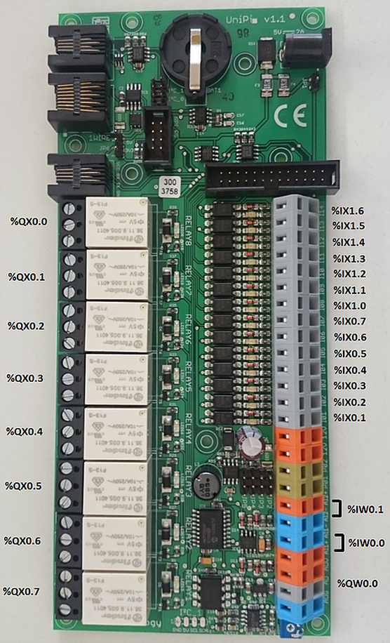

Make sure that your UniPi is running a recent version of the Raspbian
operating system. To avoid compatibility problems, it is better to download
the most recent Raspbian form the
[Raspberry Pi website](https://www.raspberrypi.org/downloads/) and make a fresh
install.​

The best way to get OpenPLC files into your UniPi is by using git. Usually,
git comes pre-installed on Raspbian. If for some reason you don't have git
installed on your system, you can install it by typing:
​
```
sudo apt-get install git
```
​


Before starting OpenPLC runtime, you will need to load the I2C module into the
kernel. This will enable OpenPLC to communicate with the I2C peripherals on
your UniPi board. To load the I2C module, type:

​```
gpio load i2c
```

A reboot is needed after using this command. You only need to type it once.

Now that your system is configured, just reboot your device and OpenPLC will
start automatically after boot.



## Pin Mapping

By default OpenPLC runtime is installed with a blank driver. This means that
it won't be able to control your UniPi inputs and outputs straight away. To
enable the UniPi driver, go to the "Hardware" section and, from the popup
menu, select "UniPi v1.1". Click on "Save changes" and wait for a little bit
while the driver is applied.

Below you will find the OpenPLC I/O mapping for the UniPi board. The mapping
should be the same across all the different board revisions.




