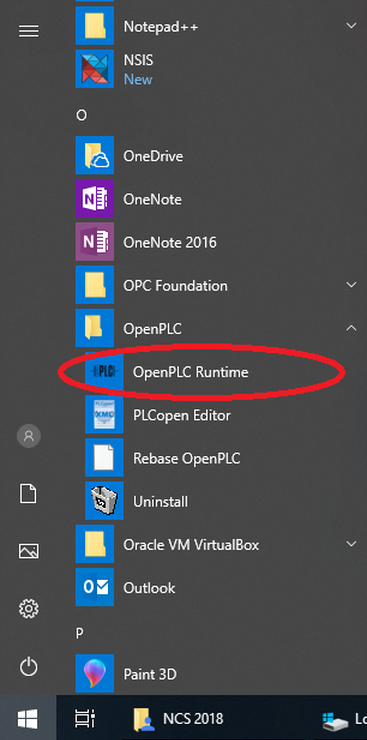
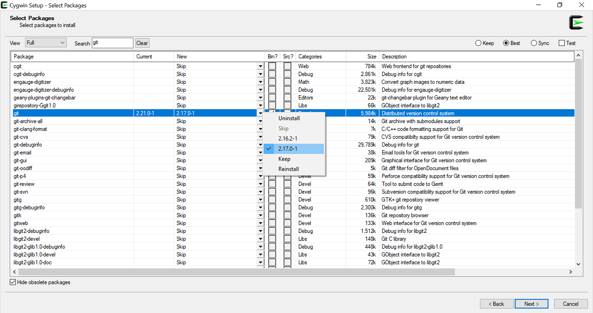

Installing OpenPLC on Windows is as easy as it can get! Just download the
installer and run it. Please make sure you have a reliable connection to the
internet while running the installer as it downloads the latest packages from
the web.

<div class="download-link">
    <a href="https://drive.google.com/file/d/1b7qwMSAC9saOVaIPuSw0276b10_uv-Pv/view?usp=sharing">
      
      <span>OpenPLC Runtime Installer</span>
    </a>
</div>

The Windows installer also comes bundled with
[OpenPLC Editor](https://www.openplcproject.com/plcopen-editor). So, you don't
need to download it separately if you're installing this on your system.

Once OpenPLC Runtime is installed, you can start it by going to the start
menu and launching the OpenPLC Runtime shortcut.



## Troubleshooting

In general, OpenPLC installation issues are related to bad directory paths or
denied permissions. That's why it is always recommended to run the installer
as admin. In any case, here are some troubleshooting guides for people that
are having issues with the installer:

**1) Rebase OpenPLC**

The first thing to do if OpenPLC is not launching after installation is to run
the "Rebase OpenPLC" shortcut from the start menu. It will try to look for and
fix general installation problems.

**2) Install Cygwin Manually**

If rebasing OpenPLC didn't work, there might be something else affecting your installation, and that's usually Cygwin. In that case, a manual Cygwin installation might be required. To install Cygwin manually, download the installer from [https://cygwin.com/install.html](https://cygwin.com/install.html). There are two options: setup-x86_64.exe for 64-bit machines and setup-x86.exe for 32-bit machines. Most likely your computer is a 64-bit machine, so download setup-x86_64.exe and run it. The installation process is very simple. On the first screen, select "Install from Internet", and on the next screen, make sure you install it inside the OpenPLC folder. That should be C:\Users\[your-user-name]\OpenPLC\Runtime. This is very important! If you install Cygwin on another directory, this procedure won't work. On the next screen, leave the Local Package Directory as default. When you reach the Available Download Sites list, pick the first one and hit next. This will take you to the Select Packages list. On this list, select View Full and search for the packet git. The table will be populated with several packages related to git. Select the one named git (it is just plain git, not cgit or git-cvs or git-gui). With that package selected, on the drop-down box inside the column "New", select the latest version available for git (at this time of writing it is 2.17.0-1) and hit next.



You will see a summary of all items to be installed. Hit next and let the installation begin. Once Cygwin had finished installing, try launching "Rebase OpenPLC" again from the start menu.

**3) Install OpenPLC Manually**

If even after installing Cygwin manually you can't start OpenPLC, then you
probably will have to install it manually as well. The process is simple and
straightforward. You will need to open Cygwin Terminal and type:

```
git clone https://github.com/thiagoralves/OpenPLC_v3.git
cd OpenPLC_v3
./install.sh win
```

After typing these 3 commands, OpenPLC installation will start. It may take a
while (up to 15 minutes depending on your computer and internet speed). Once
the installation finishes, you can start OpenPLC by launching the OpenPLC
Runtime shortcut on the start menu or by typing:

```
./start_openplc.sh
```

on Cygwin Terminal.

## Running OpenPLC

The OpenPLC runtime has a nice web interface that you can access. While
OpenPLC runtime is running, open your browser and type:

```
localhost:8080
```
​
Once you access OpenPLC web interface, you should see in your browser window a login page like this:


The default username and password is openplc (login) and openplc (password).
This means that the first thing you must do after logging in for the first
time is **change the default username and password**! It is very easy to do
that. Just go to the Users menu, click on the OpenPLC User and change the
information as you like.


Once you save the changes you will be prompted to login again. Just login with
your new credentials and you will be good to go!

## Setup Slave I/O

A great way to use OpenPLC on your Windows machine is with slave I/Os.
Therefore, your Windows machine can run OpenPLC Runtime and act as a Soft-PLC
controlling real boards configured as Slave I/O devices. Go to the Getting
\Started page and follow the instructions to setup one of the supported
platforms as slave devices. Then, through the web interface, add your slave
devices on the "Slave Devices" menu. Keep in mind that slave devices are
attached to address 100 onward (i.e. %IX100.0, %IW100, %QX100.0, and %QW100).


